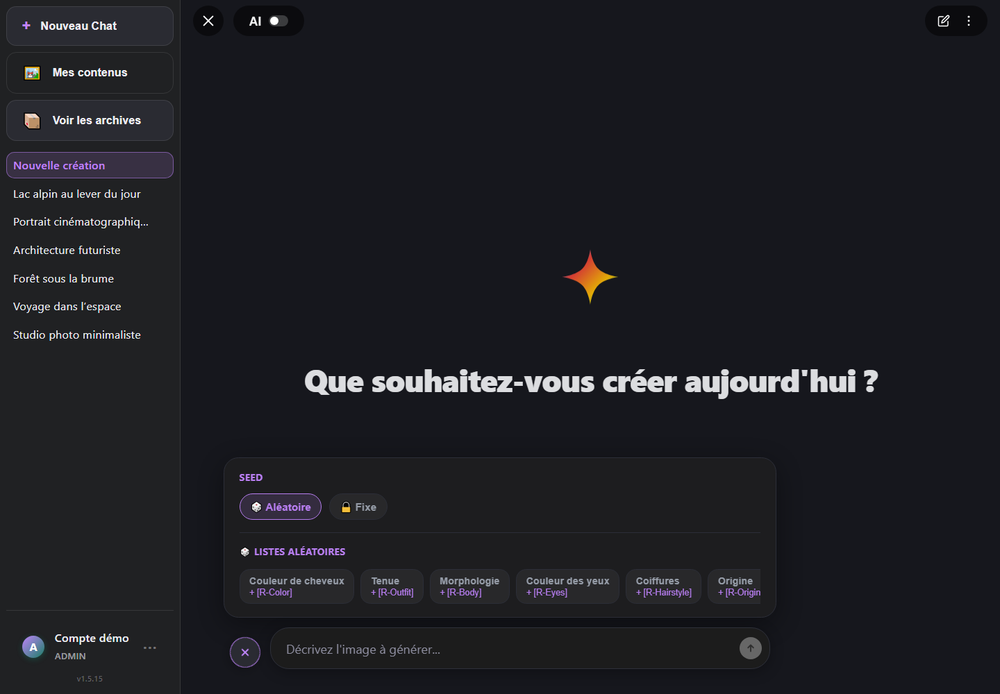
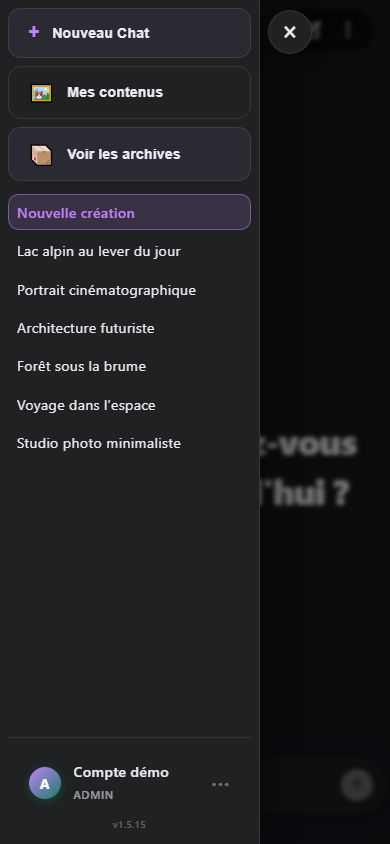
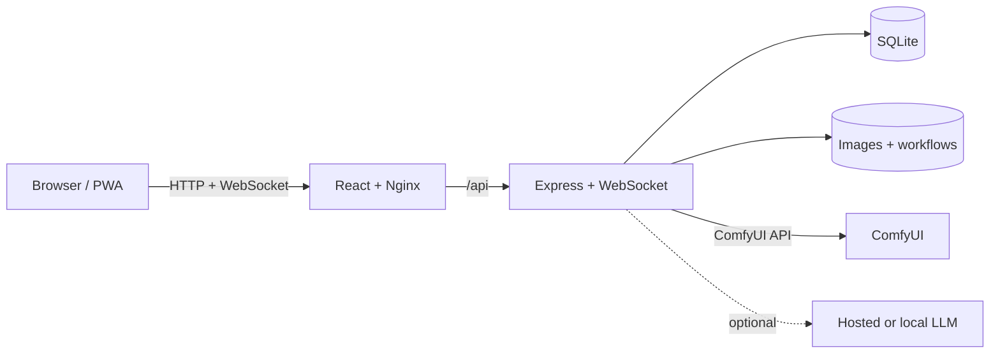

<div align="center">

# ComfyForge

**A self-hosted, multi-user workspace for generating, comparing, organizing, and rediscovering ComfyUI images.**

[](https://github.com/leguigou/ComfyForge/actions/workflows/docker-publish.yml)
[](https://github.com/leguigou/ComfyForge/actions/workflows/codeql.yml)
[](https://github.com/leguigou/ComfyForge/releases/latest)
[](LICENSE)

</div>


ComfyForge connects a React application, an Express API, SQLite storage, and real-time WebSocket updates to your existing ComfyUI installation. Accounts, settings, prompts, and generated images remain on your own machine or server.

> ComfyForge is a companion for ComfyUI, not a replacement. You still need a working ComfyUI instance and the models and custom nodes required by your workflows.

## What's new in 2.8.1

Version 2.8.1 improves active-generation control, makes destructive actions safer, and polishes image and text interactions across desktop and mobile.

- **Editable active generations:** prompts can be corrected while queued, preparing, or processing; an in-progress ComfyUI job is interrupted safely and its replacement is queued without losing rewritten-prompt behavior.
- **Stable rapid regeneration:** repeated regeneration requests keep completed images in place, focus the active result after refresh, and preserve exact navigation back to the originating message.
- **Safer deletion flows:** message, conversation, gallery, and bulk deletion actions prevent duplicate submissions, show progress, and keep grouped gallery contents and counters aligned.
- **Expanded image actions:** gallery and conversation images expose consistent context menus, information and prompt panels, regeneration controls, and detached close buttons that work reliably after a touch long press.
- **More reliable mobile clipboard handling:** pasted prompts strip embedded LoRA tags, text copying falls back when the asynchronous Clipboard API is unavailable, and contextual text actions remain editable during active generation.

## What's new in 2.8.0

Version 2.8.0 turns the gallery into a more flexible image library, adds opt-in Civitai-compatible exports, and makes generation actions more precise across desktop and mobile.

- **Advanced content filters:** a compact responsive menu filters the complete gallery by multiple models, workflows, and square, portrait, or landscape formats, with clear active states, result counts, and one-click reset.
- **Adjustable gallery density:** desktop users can move from one to twelve columns with a persistent `− / +` control, while touch devices retain pinch-based column changes.
- **Manual and conversation-scoped galleries:** any compatible selection can become a custom image group with a chosen cover, groups can be dissolved safely, and each conversation exposes its own photo library without leaking results from other threads.
- **Civitai-ready downloads:** users can link local checkpoints or diffusion models to Civitai resources and optionally embed generation and model metadata into downloaded WebP files without modifying stored originals.
- **Safer image and prompt actions:** custom long-press menus expose image actions on touch devices, text can be translated through the active LLM provider, paired prompts and generations are deleted together, and batch gallery operations keep grouped results aligned.
- **Targeted cancellation:** cancelling a queued generation removes only that job, while an active ComfyUI render is interrupted only when it is the selected target; unrelated work remains in the queue.

## What's new in 2.7.4

Version 2.7.4 makes gallery filters easier to build and retain, clarifies deployment-version mismatches, and fixes archived-chat navigation on mobile.

- **Cumulative prompt-tag filters:** tags in image prompt details are interactive and add to the existing gallery filters without duplicates instead of replacing them.
- **Persistent gallery filtering:** selected prompt tags, favorites, liked prompts, and archived-content filters survive page refreshes.
- **Clearer deployment diagnostics:** the update panel compares interface, server, and GitHub versions, while mismatch reminders link directly to remediation details and can be snoozed for two hours.
- **Aligned sidebar navigation:** the main navigation uses equal-sized icon slots and a consistent circled new-chat icon so labels stay perfectly aligned.
- **Stable archived conversations:** selecting a conversation from the archive list keeps the archive context while opening its message feed instead of switching back to active chats.

## What's new in 2.7.3

Version 2.7.3 makes very large image libraries faster to browse, easier to organize, and simpler to maintain without sacrificing authenticated access.

- **Bidirectional gallery pagination:** after a fast-scroll jump, approaching either edge loads the next or previous 48 results, preserves the visible position while prepending, and lets users return continuously to the very first image.
- **Prompt-grouped browsing:** identical generation prompts can be collapsed into one gallery card with a result count, aggregate favorite indicators, and seamless navigation through every image in the group.
- **Sharper gallery filters:** dedicated controls expose image favorites, liked prompts, grouped prompts, and archived content while preserving total counts and direct indexed jumps.
- **Responsive thumbnail pipeline:** the gallery selects 160, 256, or 400 px WebP files for the actual screen density, prioritizes the first rows, and creates missing variants on demand or through an idempotent backfill command.
- **Faster protected image delivery:** short-lived authentication caching avoids repeated SQLite lookups for image grids, while Docker deployments can delegate authorized transfers to the bundled Nginx through `X-Accel-Redirect`.
- **Self-service thumbnail maintenance:** users can inspect and purge their own thumbnail cache from Settings without deleting originals; variants are recreated automatically when needed.
- **Storage visibility:** statistics now separate full-resolution originals from thumbnail-cache usage for each user, with responsive storage summaries on smaller screens.

## What's new in 2.7.2

Version 2.7.2 makes large mobile galleries dramatically faster to navigate, strengthens Lucky prompt creation and recovery, and polishes the first-run and administration experience.

- **Android-style gallery fast scroll:** a full-height touch rail maps directly to the complete result count, enlarges while active, displays the current image number, and jumps to the oldest generations without loading thousands of cards into the page.
- **More coherent Lucky references:** reference groups now require direct semantic connections, exclude generic pose, lighting, and composition matches, show their verified shared themes, and support rerolling one reference or the complete selection.
- **Recoverable Lucky creation:** pending Lucky prompts are persisted before the LLM responds, protected from premature retries, and restored as retryable prompts if generation cannot be queued.
- **Safer recovery cleanup:** expired Vision recovery records and temporary imports are cleaned together, with dedicated regression coverage.
- **Faster creation shortcuts:** rotating welcome suggestions can open image analysis, reuse recent or favorite prompts, or start focused portrait and cinematic ideas immediately.
- **Mobile and administration polish:** queue and settings layouts fit smaller screens more reliably, dialogs remain bounded, and empty chats can be removed immediately without bypassing confirmation for chats containing messages.

## What's new in 2.7.1

Version 2.7.1 streamlines account creation and adds an opt-in desktop workflow for prompts copied from other applications.

- **Focused user creation:** administrators now start from a clear action above the user list and create an account in a responsive dialog with password confirmation, role selection, queue quota controls, inline errors, and keyboard focus management.
- **Clipboard-to-generation automation:** supported Chromium browsers can watch for newly copied text, sanitize it, fill the prompt, and start a generation automatically after explicit opt-in.
- **Clearer update status:** development builds newer than the latest published GitHub release are identified explicitly instead of being described as the latest release.

## What's new in 2.7.0

Version 2.7.0 makes account administration clearer, Vision analysis more controllable, and everyday image workflows smoother across desktop and mobile.

- **Complete user editor:** administrators can open any user from a cleaner table and update the username, role, avatar, password, and generation quota in one responsive dialog, with account statistics kept visible.
- **Per-user queue quotas:** schema 5 persists a limited or unlimited quota for every account, exposes active usage to administrators, and preserves fair queue scheduling.
- **Controllable Vision analysis:** five detail levels tune prompt length and model output, in-progress analysis can be cancelled cleanly, and imported temporary files are removed after cancellation.
- **Smoother generation controls:** the options drawer is clearer on desktop and mobile, random-list tokens behave as complete editable units, and image placeholders reserve their final layout before loading.
- **Polished image browsing:** mouse-wheel lightbox zoom, streamlined actions, generated avatar thumbnails, consistent vector icons, and more stable navigation reduce visual jumps.
- **More resilient frontend updates:** lazy-module recovery, safer service-worker caching, and eagerly loaded modal shell styles avoid stale chunks and first-open positioning glitches.

## What's new in 2.6.0

Version 2.6.0 makes long-running Vision analysis recoverable and restores reliable visual activity indicators across the interface.

- **Recoverable Vision prompts:** image-analysis results are persisted before the HTTP response, then automatically recovered after a mobile connection loss or page reload.
- **Clear Vision progress:** the imported-image scanner is animated consistently, shows elapsed time, and focuses the recovered prompt when analysis completes.
- **Reliable status animations:** loaders, session spinners, gallery and comparison indicators, queue pulses, statistics loaders, and companion sprites are no longer accidentally frozen by the global reduced-motion rule.
- **Database schema 4:** user-scoped Vision recoveries retain completed prompts for seven days without exposing them to other accounts.

## What's new in 2.5.0

Version 2.5.0 focuses on safer upgrades, fair multi-user operation, faster large libraries, and a smoother first launch.

- **Guided first run:** new installations get a keyboard-accessible wizard that checks ComfyUI, discovers installed models and workflows, loads workflow defaults, and saves a ready-to-use configuration.
- **Fair generation queue:** queue entries have an explicit owner, configurable per-user and batch limits, and round-robin scheduling that preserves each user's FIFO order.
- **Administrator queue view:** administrators can inspect queue ownership, age, user load, model, and workflow, then cancel work that is still pending.
- **Faster large libraries:** gallery search uses SQLite FTS5, gallery and comparison history use stable cursor pagination, and composite indexes support the most common history queries.
- **Safer delivery:** health and schema state are exposed through `/api/health`, frontend/backend version drift is visible to administrators, PWA updates wait for confirmation, and Docker healthchecks are included.
- **Smaller initial download:** settings, statistics, comparisons, and onboarding are loaded only when needed; the main JavaScript chunk is kept below a 450 KiB build budget.
- **Security and diagnostics:** request IDs, structured HTTP logs, tighter JSON limits, CSP and related browser protections, plus user-scoped WebSocket queue updates improve traceability and isolation.
- **Backup tooling:** `npm run backup` in the backend and `scripts/backup-data.ps1` create verified SQLite backups before maintenance or migration work.
- **Stable navigation and accessibility:** deep links cover chat, gallery, comparisons, and statistics; modal focus handling, reduced-motion support, labels, and keyboard access have been expanded.

## Feature overview

### Generation and queue management

- Real-time ComfyUI progress, queue status, elapsed time, cancellation, retry, and retry-all for incomplete generations.
- Targeted cancellation distinguishes pending jobs from the active ComfyUI render and preserves unrelated queued work.
- Optional desktop clipboard automation on supported Chromium browsers: copy new text to fill the prompt and start generation immediately.
- Prompt, negative prompt, checkpoint or diffusion model, workflow, width, height, seed, steps, CFG, sampler, and scheduler controls.
- Fixed or random seeds, reusable random prompt lists such as `[R-Color]`, and regeneration with fresh dynamic selections.
- Pending-prompt editing before execution and synchronized status updates over WebSockets.
- Distinct Preparing, Waiting, and Processing stages, with retries reusing the failed card and timers based on persisted render duration.
- Favorite models with associated workflows and saved generation defaults for one-click switching.

### Prompt intelligence

- Optional automatic or one-shot prompt enhancement through hosted or local LLMs.
- Presets for OpenAI, Anthropic, Google Gemini, DeepSeek, xAI, Mistral, Groq, OpenRouter, Together AI, LM Studio, and Ollama, plus custom OpenAI-compatible endpoints.
- Multiple stored providers, per-user active-provider selection, model discovery, connection checks, and encrypted API keys.
- Vision-based image analysis and prompt reconstruction with a dedicated multimodal provider, model, system message, and local-model time-to-live.
- Image variation by natural-language instruction, with optional seed preservation.
- Quick commands for AI enhancement, Lucky generation, seed, steps, CFG, and prompt reuse.

### Library and discovery

- Progressively loaded conversation history, archives, bulk archive/delete tools, gallery browsing, image favorites, and liked prompts.
- Multi-select filtering by model, workflow, and image orientation, plus a persistent one-to-twelve-column desktop density control.
- Conversation-scoped photo libraries and manual image groups with selectable covers, safe ungrouping, and complete group navigation.
- Android-style gallery fast scroll with a global image counter and direct paginated jumps across very large libraries.
- Long-press/Shift-click gallery selection with batch regeneration, Lucky creation, favorite and prompt-like changes, and deletion.
- Automatic prompt tags, tag search and filtering, tag-focused browsing, prompt reuse, and random selection from liked or favorite content.
- Lucky generations built from weighted, coherent, non-duplicate liked-prompt references, with a visual preview and reroll controls.
- Full-resolution lightbox, metadata, downloads, thumbnails, and direct navigation back to the originating chat.
- Optional Civitai resource linking and Civitai-compatible metadata embedded into downloaded WebP copies without altering stored images.

### Model comparison

- Re-render an existing image with another favorite model while preserving the prompt and seed.
- Keep multiple comparison versions linked to the original and follow queued or active versions in real time.
- Compare any two same-size completed versions with a draggable split slider, zoom, pan, and reset controls.
- Record pairwise preferences as left, right, or tie; inspect generation metadata and delete individual variants.
- Browse a dedicated comparison history with a configurable one-to-six-column grid and touch pinch controls.
- Select multiple comparison sources to generate them with one favorite model or delete completed comparison groups in bulk.

### Statistics

- Week, month, and year ranges with previous-period comparisons.
- Generated images, attempts, failures, success rate, average render time, and conversation counts.
- Activity charts for generations, model usage, LLM text/vision calls, favorites, and liked prompts.
- All-time totals, ranked models, top workflows, and LLM failure/performance summaries.
- Per-user disk usage split between full-resolution originals and the thumbnail cache, without extra statistics queries in SQLite.
- Searchable tag analytics with category and favorite/liked-prompt scopes.

### Administration, privacy, and UX

- Isolated user accounts, administrator-managed users, password changes, and per-user storage.
- Encrypted LLM credentials in SQLite, authenticated image access, rate limiting, service URL validation, and configurable origin allowlists.
- Searchable audit logs for ComfyUI and LLM exchanges.
- Light and dark themes, responsive desktop/mobile layouts, PWA support, custom profile images, and customizable generation companions whose sprite files are stored privately per user.
- English and French interface translations.

| Generation options | Mobile interface |
| --- | --- |
|  |  |

## Quick start with Docker

### 1. Requirements

- Docker Desktop, or Docker Engine with Docker Compose v2
- Git
- ComfyUI running on port `8188`

If ComfyUI runs on the same host, it must accept connections from Docker. On Linux, this usually means starting it with:

```bash
python main.py --listen 0.0.0.0 --port 8188
```

Do not expose the ComfyUI port directly to the Internet.

### 2. Download and configure ComfyForge

```bash
git clone https://github.com/leguigou/ComfyForge.git
cd ComfyForge
```

On Windows, the setup helper creates `.env`, asks for the initial administrator password, and generates a secret:

```powershell
powershell -ExecutionPolicy Bypass -File scripts\init-env.ps1
```

On Linux or macOS:

```bash
sh scripts/init-env.sh
```

You can also copy `.env.example` to `.env` and set `APP_PASSWORD`, `AUTH_SECRET`, and `COMFY_URL` manually.

### 3. Start the application

```bash
docker compose -f docker-compose.production.yml up -d
```

Open <http://localhost:5173> and sign in with:

- username: `admin`
- password: the password selected during setup

`APP_PASSWORD` is used only when the first administrator account is created. Changing it later in `.env` does not update the existing account.

### 4. Generate your first image

1. Open **Settings** and verify the ComfyUI connection.
2. Import or select an API-format workflow compatible with your installed models and nodes.
3. Review the detected workflow mapping and choose a model.
4. Enter a prompt and start the generation.

Example workflows may require additional ComfyUI models or custom nodes. See the [workflow guide](docs/workflows.md) to use your own workflow.

## Workflows and models

ComfyForge accepts JSON exported from ComfyUI with **Save (API format)**. Its mapping assistant detects the relevant checkpoint or diffusion loader, positive and optional negative prompts, main sampler, latent dimensions, and image output node. You can review the mapping, save corrections, replace a workflow, and retain defaults extracted from the file.

Favorite models can be associated with a workflow and generation defaults. This association powers one-click model activation and the model comparison workspace.

## LLM and vision setup

LLM features are optional. In **Settings > AI (LLM)** you can install multiple provider profiles, discover available models, test connections, and select the active text provider. API keys are encrypted on the backend and are never displayed again after saving.

Image import requires a separate vision-capable provider/model selection. The model must support image inputs. Supported upload formats are JPEG, PNG, WebP, and AVIF, up to 15 MB. For local Ollama and LM Studio models, ComfyForge can release memory manually and expire an idle vision model automatically.

## Updates, data, and maintenance

```bash
# Pull the newest images and restart
docker compose -f docker-compose.production.yml pull
docker compose -f docker-compose.production.yml up -d

# Follow logs
docker compose -f docker-compose.production.yml logs -f

# Stop without deleting persistent data
docker compose -f docker-compose.production.yml down
```

Persistent data lives in:

- `backend/data`: SQLite database and application data
- `backend/workflows`: workflows and saved node mappings
- `images`: per-user images and thumbnails

Back up all three locations regularly. Never commit them to Git.

Responsive thumbnail variants are created for every new generation and lazily
for older libraries. Each user can inspect and purge their own generated
thumbnail cache from **Settings → General**; originals are preserved and the
variants are recreated on demand. To pre-generate every missing 160 px and
256 px variant after an upgrade, run:

```bash
docker compose exec backend npm run thumbnails:backfill
```

The command is idempotent: existing variants are skipped. In a local source
checkout, use `npm run thumbnails:backfill:dev` from the `backend` directory.

On Windows, a consistent SQLite snapshot plus workflows, images, version, and
private configuration can be created outside the repository with:

```powershell
powershell -ExecutionPolicy Bypass -File scripts\backup-data.ps1
```

The script verifies the SQLite snapshot with `PRAGMA quick_check`, records its
SHA-256 hash, and refuses a destination inside the repository. Backups may
contain `AUTH_SECRET` and must be stored privately.

## Configuration reference

| Variable | Purpose | Default |
| --- | --- | --- |
| `APP_PASSWORD` | Initial password for the first administrator; minimum 12 characters | required |
| `AUTH_SECRET` | Cookie signing and LLM-key encryption secret; minimum 32 characters | required |
| `COMFY_URL` | ComfyUI URL as seen by the backend | `http://host.docker.internal:8188` |
| `FRONTEND_PORT` | Web port published by Docker | `5173` |
| `CORS_ORIGINS` | Additional comma-separated frontend origins | empty |
| `SERVICE_URL_ALLOWLIST` | Allowed custom ComfyUI/LLM service origins | empty |
| `ALLOW_PRIVATE_SERVICE_URLS` | Allow literal private and loopback IP addresses | `false` |
| `ALLOW_USER_LLM_URLS` | Allow each user to choose an arbitrary LLM URL | `false` |
| `MAX_QUEUE_PER_USER` | Initial pending/processing quota assigned to users (then editable per user, including unlimited) | `25` |
| `MAX_QUEUE_BATCH` | Maximum generations accepted by one batch request | `50` |
| `IMAGE_ACCEL_REDIRECT` | Delegate authorized image transfers to the bundled Nginx (recommended with Docker) | `true` in Docker |
| `PORT` | Internal API port | `3001` |

Do not change `AUTH_SECRET` after saving API keys unless you plan to enter them again: provider credentials are encrypted with a key derived from this secret.

### Remote access

For Internet access, put the frontend behind an HTTPS reverse proxy such as Caddy, Traefik, or Nginx. Do not expose ComfyUI or the backend API directly. Review the [security policy](SECURITY.md) as well.

## Local development

Requirements: Node.js 22, npm, and ComfyUI.

Create a development configuration:

```powershell
# Windows
powershell -ExecutionPolicy Bypass -File scripts\init-env.ps1 -Development
```

```bash
# Linux or macOS
sh scripts/init-env.sh --development
```

Install dependencies:

```bash
cd backend
npm ci
cd ../frontend
npm ci
cd ..
```

Run `run.bat` on Windows or `bash run.sh` on Linux and macOS. You can also run `npm run dev` separately in `backend` and `frontend`. The development frontend is available at <http://localhost:5173>; Vite proxies `/api` and WebSocket traffic to the backend.

## Validation

```bash
cd backend
npm audit --audit-level=high
npm test
npm run build

cd ../frontend
npm audit --audit-level=high
npm run lint
npm test
npm run build
```

GitHub Actions runs these checks automatically. Dependabot monitors npm packages and GitHub Actions, and CodeQL analyzes the JavaScript and TypeScript code.

### Publishing a release

Pushing `main` publishes the rolling Docker images but does not create a GitHub Release. Maintainers must keep `VERSION`, both package manifests, and their lockfiles aligned, commit the release, then create and push the matching `vX.Y.Z` tag. The tag starts the Auto Release workflow and publishes the versioned Docker images:

```bash
git tag -a vX.Y.Z <release-commit> -m "Release vX.Y.Z"
git push origin vX.Y.Z
```

The in-app update checker reads GitHub Releases, so a version is not considered published until its tag-triggered release exists.

## Architecture



```text
frontend/           React, Vite, and TypeScript application
backend/            Express, WebSocket, and SQLite API
backend/workflows/  ComfyUI workflows and node mappings
docs/               Documentation and screenshots
scripts/            Environment setup helpers
.github/            CI, security, and contribution automation
```

## Troubleshooting

### ComfyUI is unreachable

- Verify that ComfyUI responds at `http://127.0.0.1:8188` from the host.
- Check `COMFY_URL` in `.env`.
- On Linux, start ComfyUI with `--listen 0.0.0.0`.
- Inspect backend logs with `docker compose -f docker-compose.production.yml logs backend`.

### A model or node cannot be found

The workflow references a file or extension that is missing from ComfyUI. Open the workflow in ComfyUI, install the missing custom nodes, verify model filenames, and then review the [workflow guide](docs/workflows.md).

### Port 5173 is already in use

Set another `FRONTEND_PORT` in `.env`, for example:

```dotenv
FRONTEND_PORT=8080
```

### The password from `.env` no longer works

`APP_PASSWORD` is read only when the initial `admin` account is created. Use ComfyForge administration to change an existing password.

## Contributing and license

Contributions are welcome. Read [CONTRIBUTING.md](CONTRIBUTING.md) and the [Code of Conduct](CODE_OF_CONDUCT.md) before opening a pull request.

ComfyForge is distributed under the [MIT License](LICENSE). ComfyUI, checkpoints, diffusion models, LoRAs, VAEs, and third-party workflows may have their own licenses and usage terms.
